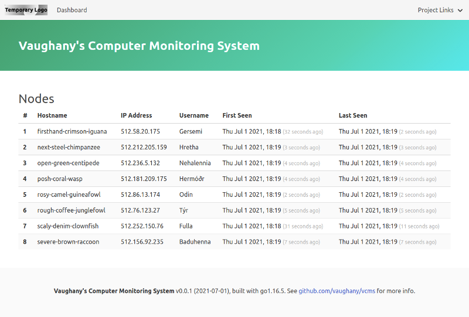

# VCMS - Vaughany's Computer Monitoring System



## What is VCMS?

> **tl;dr:**  VCMS is a work-in-progress cross-platform multi-computer health monitoring tool, and is a side-project I am working on to learn [Go](https://golang.org/).  Be kind!

I've used [Munin](https://munin-monitoring.org/) for years and [M/Monit](https://mmonit.com/) a lot also.  Both are excellet montoring solutions.  I wanted to try my hand at something similar, as a learning exercise.

VCMS is two programs: one (called Collector) sits on a computer and monitors it's state, periodically sending the information to the other (called Receiver) which makes a nice live web page out of it.  You can have as many collectors on as many computers as you like.

This project is the result of a much larger, private project in which I attempted too much too soon, with minimal Go knowledge.  The scope crept faster than my knowledge and ability to implement it, and it got unwieldly and complex, so this is me 'starting over', one feature at a time.


### Metrics recorded

* hostname
* username
* IP address
* first seen
* last seen

> **Note:** this project is in no way feature-complete!

### Tested with:

* Ubuntu:
  * ~~16.04 LTS~~
  * 18.04 LTS
  * ~~20.04 LTS~~
* Windows:
  * ~~10~~

---

## Basic Linux Installation

1. Download the binaries ([from here](https://github.com/vaughany/vcms/tree/main/bin)).  They're not large.  You'll need both the Collector and Receiver for your platform.

   * Ubuntu [Collector](https://github.com/vaughany/vcms/raw/main/bin/collector) and [Receiver](https://github.com/vaughany/vcms/raw/main/bin/receiver)
   * ~~Windows Collector and Receiver~~
   
2. Open two terminals, `cd` to the download location in each.

3. Run the Receiver in one terminal:

   `./receiver`

   > **Note:** you might have to make it executable before you can run it:
   > 
   > `chmod +x receiver`

   You should see output similar to the following:

   ```
   VCMS - Receiver v0.0.1 (2021-07-01), go1.16.5.
   Receives data from the Collector apps, creates a web page. 
   Running web server on http://127.0.0.1:8080.
   ```

4. Run the Collector in the other terminal:

   `./collector`

   > **Note:** you might have to make it executable before you can run it:
   > 
   > `chmod +x collector`


   You should see output similar to the following:

   ```
   VCMS - Collector v0.0.1 (2021-07-01), go1.16.5.
   Collects information about the computer, and sends it to the Receiver app. 
   Sending data to http://127.0.0.1:8080/api/announce
   Response: 200 OK
   ```

   > **Note:** If that `200 OK` line is not there, there's a problem somewhere.

   In the other terminal running the Receiver, you should see the following:

   ```
   Received data from 127.0.0.1:8080
   ```

5. I've tried to make both programs user-friendly, so you can specify the following flags:

   `-d` for 'debug mode', which basically makes the output more verbose.

   `-v` for version info.

   `-h` for help.  More options will most likely be added over time.

6. For testing purposes, so I could run multiple Collectors on just one computer, I added a testing mode which generates random hostname, IP address and so on.  For each extra Collector that you want to run, open a new terminal for it and run it with the `-t` flag:

   ```
   ./collector -t
   ```

   Random hostnames are in the format _adjective-color-animal_, IP addresses always start with the number '512', and the username is a Norse god.

---

## Better Linux installation

By default, the Receiver runs the web page and API on `127.0.0.1` ('localhost') on port 8080.  These are fair defaults, but won't work outside your computer.

Both programs allow you to specify the IP address and port to use with the `-r` flag.  

1. To run Receiver on a different IP address and/or port:

   ```
   ./receiver -r 192.168.0.100:8081
   ./receiver -r mywebsite.com:8081
   ```

   > **Note:** do not specify the protocol.  We're using `http` for now.

   Receiver will complain if it cannot use the IP address or port you specify.  Ideally, you should be using the IP address of your computer as shown in `ifconfig`.

2. Make the Collector use a different IP address and/or port:

   ```
   ./collector -r http://192.168.0.100:8081
   ```

> **Note:** Some TCP/IP ports, such as the standard web port 80, are restricted and cannot be used unless you run the program with elevated privileges:
>
>`./receiver -r 192.168.0.100:80 // reserved port: fails.`
>
>`sudo ./receiver -r 192.168.0.100:80 // works.`

---

## Use

When you run the Receiver, it mentions a URL (`http://127.0.0.1:8080` by default).  Click it, or copy-paste it into your web browser.  You should see a nice, if basic web page detailing the hosts in alphabetical order of host.  Web page accesses are logged.  The page will automatically refresh every 60 seconds.

A 'ping' API endpoint is provided so you can check if the Receiver is responding:

`http://127.0.0.1:8080/api/ping`

Accessing the above should return the following JSON response:

`{"result":"pong"}`

Pings are logged.

> **Note:** You can of course access the above from a web browser as it's a simple 'GET' request, or 'curl' it if you prefer:
>
> `curl http://127.0.0.1:8080/api/ping`

---

## Building from source

If you have Go installed, clone the repo and build it yourself. 

### Linux:

1. Clone the repository, e.g.:

   `git clone git@github.com:vaughany/vcms.git`

2. Change directory into the folder:

   `cd vcms`

3. Run the following helper script to run a variety of tests on the code (you may have to install some Go tools):

   `./format.sh`

4. Run the following command to build the binaries for your architecture (Go figures it out) and put into `bin/`:

   `go build -trimpath -ldflags "-s -w" -o bin/ ./cmd/...`

5. Alternatively, run the helper script `./build.sh` to build Linux and Windows binaries.  Add or amend as you see fit to build as many different binaries as required.

6. Run the Collector:

   `./bin/collector`
   
7. Open a new terminal and (assuming the same folder) run the Receiver:
   
   `./bin/receiver`

---

## Troubleshooting and Gotchas

1. The Collector **needs** to be able to connect to the Receiver on the chosen URL, or the Receiver will never receive any data.  You might not be able to communicate across VLANs, for example.

2. Data the Receiver receives is stored only in memory at this time.  If you quit the Receiver, everything is lost. 

3. We currently only use HTTP, which means your data is not encrypted in transit.  For my intended use, this is not a huge concern, but it might be for you.  Addressing this is on the to-do list.

---

## To do

There's a lot I want to do:

* Receiver to persist data to disk (with SQLite).
* Store historical data for comparison, graphs etc.
* Choice of HTTP or HTTPS.
* Create a proper web-app with secure login.
* Create groups to group Collectors by, e.g. 'dev', 'production' etc.
* Authentication of Collectors by e.g. pre-shared key.
* More active monitoring, with alerts should something go awry.
* Web-based, Email and Slack notifications of alerts.
* Monitor software deployed by the Ruby gem Capistrano.
* Make web page refresh configurable.

---

## History

* **2021-07-01**, v0.0.1.  Initial release.  Collector registers basic info with the Receiver.

---

## Contributing and reporting issues

If you want to contribute, you're more than welcome.  This is a learning project for me, but I'm happy to consider a pull request that fixes an issue, or adds something useful (such as instructions for installation, use, and building from source on Windows or macOS).

Feel free to file a [bug report or feature request](https://github.com/vaughany/vcms/issues/new/choose) if you find bugs or think of cool features.  Happier with a pull request, but happy to learn from a bug or feature request also. 

---

## About

I'm Paul 'Vaughany' Vaughan, and I've been doing dev-ops for a while and web development for _ages_.  I'm learning Go, and finding interesting little projects to create with it, usually trying to do a better job than just a Bash script run via Cron.  This is one such project.  I'm publishing it online as I develop it, rather than as a finished product, so please remember this if you use this software or get in touch.  If you want to contact me, my email address is _paulieboo at gmail dot com_ and on my [GitHub profile](https://github.com/vaughany/).

---

## Licence

[GNU GPLv3](https://choosealicense.com/licenses/gpl-3.0/):

"_Permissions of this strong copyleft license are conditioned on making available complete source code of licensed works and modifications, which include larger works using a licensed work, under the same license. Copyright and license notices must be preserved. Contributors provide an express grant of patent rights._"
